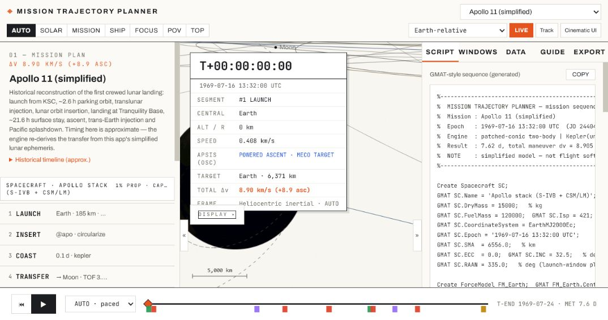
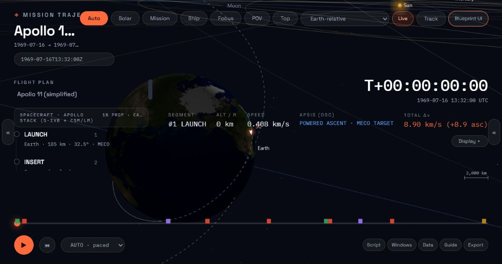

# Mission Trajectory Planner

A dependency-free, browser-based orbital mechanics simulator and
interplanetary mission-design tool in the spirit of NASA GMAT and Ansys STK.
It is written in plain ES2020 JavaScript, has no package manager or build step,
and runs from static files, GitHub Pages, or the included local server.

Mission Trajectory Planner is an educational design environment, not an
operational flight-dynamics, navigation, telemetry, or conjunction-screening
system. Every higher-fidelity mode is opt-in, bounded, and labelled with its
model limits.

Keywords: orbital mechanics, astrodynamics, mission design, trajectory
planner, patched conics, Lambert solver, gravity assist, delta-v budget,
porkchop plot, ground track, rendezvous, docking, multi-spacecraft missions,
CR3BP, Lagrange points, halo orbit, Lissajous orbit, finite thrust, n-body
propagation, SGP4, SDP4, Monte Carlo.

## Interfaces

Blueprint Light uses the project's paper, ink, and orange technical-drawing
language:

Cinematic Overlay uses the matching dark glass and ember mission-control
language:

Both themes expose the same Planner, Windows, Data, Track, Display, uncertainty,
and mission-editing capabilities. `live.html` uses the same two design
languages for the combined Earth 100 and Deep 100 tracker.

## What it does

- Propagates patched-conic missions through launch, coast, impulsive and finite
  burns, transfers, departures, flybys, insertion, observation, landing,
  ascent, return, and reentry segments. Explicit local hyperbolae make
  child-to-parent departures and returns continuous in position, velocity, and
  elapsed time at sphere-of-influence handoffs.
- Solves universal-variable Kepler motion, Lambert transfers, bounded B-plane
  encounter targeting, arrival-plane tangent periapsis, and insertion goals.
  The Windows workspace provides a browser-chunked porkchop plot and a genuine
  joint departure-date/time-of-flight solve evaluated through the mission
  engine before an explicit Apply action.
- Offers selectable adaptive Dormand-Prince 5(4) propagation with moving point
  masses, dense output, collision/SOI events, integrated finite thrust and mass
  depletion, first-order Earth J2 secular propagation, or an Earth environment
  stack with drag, SRP/eclipses, and zonal J2/J3/J4.
- Includes a bounded 20-body NASA/JPL Horizons Planner table: 15,380 immutable
  Sun-centered ICRF/ecliptic J2000 rows covering 2026-06-27 through 2026-08-26.
  Cubic-Hermite interpolation is used only inside each body's stated coverage;
  configured Horizons arcs fail closed outside it.
- Supports TLE and CCSDS OMM General Perturbations records with
  Vallado-compatible near-Earth SGP4 and deep-space SDP4. Planner `gp_orbit`
  segments and Earth 100 evaluate the GP model at the requested epoch rather
  than treating mean elements as osculating Kepler elements.
- Models ideal Sun-Earth and Earth-Moon CR3BP systems with L1-L5, synodic
  frames, corrected Lyapunov/halo families, a bounded Lissajous seed, Jacobi
  reporting, and deterministic reference-tracking stationkeeping.
- Models launches from named real sites, including Kennedy, Vandenberg, Boca
  Chica, Baikonur, and Kourou, with latitude inclination limits, rotation
  credit, MECO ellipse, and circularization.
- Propagates a native mission fleet of one primary plus up to seven secondary
  vehicles. Exact separation states, bounded phasing/Lambert rendezvous,
  capture-gated docking, joined-state following, and independent undocking are
  editable and rendered in one synchronized timeline. This is a test-particle
  mission model, not contact, assembly-mass, attitude, navigation, or
  autonomous-guidance simulation.
- Computes native selected-vehicle range/rate, closest approach, and bounded
  conjunction-threshold intervals in Data. Playback, Track, POV, Auto Time,
  timeline ticks, eclipse/access reports, and GIF export follow the selected
  vehicle's own state coverage.
- Provides live osculating elements, bounded time-series plots and CSV,
  conical umbra/penumbra intervals and timeline bands, sensor swaths, Earth J2
  rates, station access, station markers, and selectable 3D eclipse cones.
- Includes a browser-persisted user-station editor for up to 32 stations and a
  bounded multi-craft manager. The UI renders the primary mission plus up to
  seven comparison craft, with relative range, closest approach, conjunction
  timeline events, colors, and CSV. The analysis core accepts up to 128 state
  providers.
- Provides reproducible endpoint uncertainty studies with positive-semidefinite
  covariance validation, optional RTN maneuver execution error, supplied or
  finite-difference state-transition matrices, process noise, and seeded Monte
  Carlo. The Planner panel deliberately exposes diagonal Cartesian state
  sigmas, 100-5,000 samples, one local two-body horizon, 95-percent endpoint
  radii, and an XY ellipse. Within that same horizon and a matching uninterrupted
  Kepler coast, access and fleet reports can linearly propagate primary position
  covariance to nominal pass-maximum and closest-approach epochs. The displayed
  bound is a conservative first-order estimated-95% upper bound; event times
  remain nominal, comparison-craft covariance is not modeled, and no
  probabilistic interval is claimed.
- Ships 30 preset missions in a grouped catalog, including the completed,
  date-pinned Artemis II crewed lunar flyby plus Apollo, Cassini, Voyager,
  Europa Clipper MEGA, and early Parker Solar Probe
  reconstructions; ideal CR3BP and finite-burn demonstrations; five focused
  v1.18 validation missions; and ten v1.19 operations/multi-vehicle scenarios.
  Artemis II is the default first-load mission.
- Combines Earth 100 and Deep 100 in one Mission Tracker. Earth 100 consumes
  public CelesTrak OMM data and uses SGP4/SDP4, with a clearly labelled
  first-order J2 fallback only for unusable records. Deep 100 has exactly 100
  reviewed mission cards and a bounded static Horizons release bundle, 20
  matched reference-body records, close body focus/reference frames, ground
  tracks, optional ideal L1-L5 markers, minor-body visibility, and selected-only
  historical paths for Pioneer 10/11, Voyager 1/2, and Cassini.
- Provides free, top-down, auto, focus, and onboard POV cameras; exact physical
  planet occultation; a clustered event timeline; adaptive Auto Time; agency
  textures; PNG/GIF export; mission JSON; and GMAT-style script export.
- Keeps the Cinematic flight HUD compact by default: Segment, Altitude/Range,
  Speed, and Total delta-v remain visible, and a persisted Details control reveals the full
  osculating-apsis and engine readouts without deleting telemetry.

## Quick start

No installation or build is required. You can open `index.html` directly.
Direct `file://` operation remains supported, including the Planner and
embedded assets.

For the most consistent browser behavior, network-backed Live data, and the
optional service-worker cache, serve the folder with any static HTTP server or
publish it with GitHub Pages. No application server, package installation, or
build step is required.

Open `live.html` for the combined tracker and switch between Earth 100 and
Deep 100 without leaving the page. `deep.html` remains a compatibility redirect
to `live.html#deep`.

On phones and tablets, the Planner opens with the Plan and Data sheets closed
so the trajectory canvas remains usable. Drag one finger to orbit the camera;
pinch to zoom and move the two-finger midpoint to pan. The edge buttons open
one sheet at a time. Blueprint keeps its technical-drawing controls, while
Cinematic keeps its dark glass controls and compact floating transport.

The `ENGINE / THRUST` readout and attached canvas vector distinguish two
models: `ON` means an integrated finite-thrust segment is actively propagating,
while `IMPULSE PREVIEW` shows the direction of a solved instantaneous delta-v.
Named-site launches now use an editable, realistically timed guided-ascent
display with a vertical rise and smooth gravity turn to the exact solved MECO
state. The Planner labels this inverse-dynamics model instead of inventing a
vehicle-specific thrust or aerodynamic history; the isolated game prototype is
the forward-simulated place to test throttle, staging, mass flow, and drag.
In Data, `Station Access` finds line-of-sight passes for the selected local
orbital leg above DSN or user-station elevation masks and reports rise, set,
duration, and maximum elevation with CSV export.

### Offline behavior

- Static Planner operation works directly from `file://`.
- On HTTP(S) or GitHub Pages, `sw.js` can cache core files after the first
  successful online visit. Large generated ephemeris and texture assets are
  cached opportunistically so a storage failure does not prevent startup.
- Service workers do not run on `file://`; use the local server when testing
  HTTP offline behavior.
- Earth 100's public OMM refresh and any other network source still require a
  connection unless a valid prior cache is available. Cached data remains
  visibly dated rather than being relabelled as live telemetry.

### Textures

The repository's textures are real agency-derived imagery, not procedural
substitutes. To regenerate them, open `get_textures.html`, fetch the sources,
and save the result over the generated `js/textures-data.js`. Never hand-edit
`js/textures-data.js`.

Textures are embedded as data URIs, so PNG/GIF canvas export continues to work
without CORS tainting from `file://`.

## Preset missions

| Preset | Primary purpose |
| --- | --- |
| Apollo 11 (simplified) | Launch, translunar flight, landing, return, reentry |
| Apollo 13 free-return (simplified) | Free-return lunar geometry |
| Cassini-Huygens VVEJGA (1997) | Date-pinned Venus-Venus-Earth-Jupiter chain |
| Voyager 1 grand tour (1977) | Date-pinned Jupiter/Saturn/Titan encounters |
| Voyager 2 grand tour (1977) | Date-pinned four-giant-planet tour |
| Earth to Mars transfer (2026 window) | Launch window, transfer, insertion, descent |
| Artemis-style Moon mission | Fast patched-conic lunar design example |
| Jupiter / Europa orbiter (direct) | Hypothetical direct outer-planet design |
| Saturn / Titan lander (direct) | Hypothetical direct entry/landing design |
| Earth-Moon L2 halo (CR3BP) | Corrected ideal halo and stationkeeping |
| Continuous apoapsis raise | Integrated finite thrust and mass depletion |
| Sun-Earth L1 Lissajous seed (CR3BP) | Nonlinear propagation of a bounded seed |
| LEO environment fidelity lab | Horizons, drag, and Earth J2-J4 |
| GEO SRP and eclipse lab | Horizons, SRP, eclipse attenuation, J2-J4 |
| SDP4 deep-space validation object | Vallado object 04632 deep-space GP branch |
| LEO disposal uncertainty and operations lab | Seeded burn dispersion and operations UI |
| Earth-Mars joint targeting lab | Coupled departure-date/TOF periapsis solve |
| ISS orbital reference | Vallado SGP4 reference trajectory |
| Crew Dragon / ISS rendezvous | Compressed high-delta-v Lambert intercept and exact joined SGP4 docking |
| Apollo 11 full mission | Two-vehicle CSM/LM separation, lunar landing, ascent, docking, return |
| JWST L2 operations | Sun-Earth L2 halo operations and stationkeeping |
| Lunar Gateway halo operations | Multi-vehicle Earth-Moon halo operations |
| Apophis 2029 reconnaissance | Close-approach small-body observation geometry |
| OSIRIS-REx sample return | Earth-return entry and sample-capsule recovery |
| Sun-synchronous imaging campaign | J2 secular drift and imaging operations |
| Electric supersynchronous orbit raising | Multi-day integrated finite-thrust raising |
| LEO conjunction lab | Nominal and maneuvered closest-approach comparison |

Historical presets are date-pinned reconstructions. Their encounters are not
re-optimized for minimum delta-v.

## Mission schema and authoring

`schema.html` is a generated, dual-theme reference for the 23 supported segment
types. `docs/mission.schema.json` is the machine-readable JSON Schema. After a
segment-definition change, regenerate it with:

    node generate_mission_schema.js

Mission JSON remains plain data and can be loaded from the Planner without a
build step. `mtp-mission-2` adds up to seven secondary `vehicles`; older
single-vehicle mission files remain compatible.

## Architecture

    index.html                    dual-theme Planner shell
    live.html                     combined Earth 100 / Deep 100 tracker
    classic.html                  legacy dark shell using the same engine
    schema.html                   generated mission-schema reference
    css/theme.css                 Blueprint and Cinematic design languages
    js/constants.js               version, body catalog, launch sites
    js/kepler.js                  universal Kepler, Lambert, frames
    js/ode.js                     Dormand-Prince 5(4), dense output, events
    js/environment-models.js      atmosphere, drag, SRP/eclipse, J2-J4
    js/ephemeris-table.js         bounded immutable Hermite table reader
    js/planner-ephemeris-data.js  generated 20-body Horizons table
    js/force-models.js            adaptive gravity/environment/finite thrust
    js/sgp4.js                    TLE/OMM SGP4 and SDP4
    js/targeting.js               bounded targeting solvers
    js/cr3bp.js, js/libration.js  CR3BP and libration-region tools
    js/uncertainty.js             covariance, execution error, Monte Carlo
    js/windows.js                 cached/chunked launch-window engine
    js/analysis.js                elements, eclipse, access, swath, J2
    js/multicraft.js              synchronized multi-craft analysis
    js/propagator.js              mission engine and 23 segment executors
    js/missions.js                30 categorized presets
    js/renderer.js                painter-sorted, occultation-safe 3D canvas
    js/groundtrack.js             body-fixed equirectangular Track panel
    js/ui.js                      Planner state, UI, camera, playback, exports
    js/tracker-shell.js           shared Live shell and mode loader
    js/live.js                    Earth 100 SGP4/SDP4 controller
    js/deep.js                    Deep 100 bounded-vector controller
    sw.js, js/offline.js          optional HTTP(S) offline cache
    favicon.png                   Blueprint-style browser tab icon

The release includes bounded generated ephemeris archives and embedded agency
textures. Open `get_textures.html` when the texture sources need to be reviewed
or refreshed.

## Accuracy and model boundaries

- Approximate catalog planet positions use JPL/Standish mean elements; small
  bodies use reviewed JPL SBDB/Horizons osculating elements. These remain the
  fast default for broad date coverage.
- The optional Planner Horizons table is higher fidelity only inside its fixed
  60-day 2026 release window. It has exactly 20 bodies and 15,380 rows, is
  Sun-centered (`500@10`), uses ICRF/ecliptic J2000 vectors, and converts source
  JDTDB epochs to UTC. It is not a general historical/future ephemeris service.
- Adaptive point-mass and environment propagation is deterministic. The
  atmosphere is a static 0-1,000 km piecewise-exponential Earth model with
  rigid co-rotation; SRP is cannonball at 1 AU with finite-disk eclipse
  attenuation; Earth harmonics are axisymmetric J2/J3/J4. There is no measured
  solar/geomagnetic weather, tesseral gravity, attitude, aero panel model,
  relativity, estimation, or maneuver reconstruction.
- SGP4/SDP4 is appropriate for matching public GP records, not for propagating
  an arbitrary osculating Cartesian state. TEME is converted to a
  GMST-based pseudo-Earth-fixed frame; polar motion, full precession/nutation,
  and high-precision Earth orientation are outside the model.
- The joint transfer targeter is a bounded local solve over explicit visible
  departure-date and time-of-flight limits. It holds one B-plane aim offset
  fixed and targets one periapsis scalar with the single-revolution Lambert
  path. Evaluation yields to the browser, is cancelable, snapshots the mission,
  and verifies the applied result; it is not a global optimizer or launch-
  vehicle/OD solution.
- Uncertainty core APIs accept full positive-semidefinite 6x6 covariance, but
  the Planner form accepts diagonal state sigmas. Its displayed result is one
  seeded local two-body endpoint with bounded samples and model evaluations.
  A separate linearized two-body calculation supplies a conservative primary-
  position max-axis upper estimate at access maximum-elevation and fleet
  closest-approach epochs inside the selected horizon, but only when the
  analyzed burn matches a named mission impulse followed by an uninterrupted
  same-body Kepler coast. It does not alter nominal event times, model
  comparison-craft covariance, or cross another maneuver/force-model/frame
  boundary; its first-order estimated 95-percent regions are not operational
  confidence guarantees.
- Ideal CR3BP halo/Lyapunov/Lissajous and stationkeeping tools use idealized
  primary-secondary systems. They do not include ephemeris n-body dynamics,
  navigation covariance, or operational stationkeeping design.
- Earth 100 uses public CelesTrak OMM with exact SGP4/SDP4 evaluation when a
  record is valid. Data freshness and prediction labels describe source age;
  they do not verify activity. The view is not telemetry, certified pass
  prediction, or conjunction screening.
- Deep 100 is a bounded static NASA/JPL Horizons release, not a runtime mission
  feed. Its current asset plots 51 of 100 missions inside stated per-target
  coverage and leaves 49 catalog-only rather than inventing positions. Six
  records end at shorter official kernel bounds. Selected historical paths are
  display-only and never create a current state.
- Patched-conic handoffs, renderer occultation, finite-burn integration,
  flyby turn angle, launch geometry, frame composition, GP reference vectors,
  force terms, uncertainty bounds, operations UI, native vehicle contracts,
  and all 30 presets are
  guarded by the project's internal headless regression suite. The required
  release result is 30/30 presets with zero warnings.

## Roadmap status

The bounded v1.19 implementation is complete: design windows and targeting,
analysis/reporting, access and sensors,
native and comparison multi-craft workflows, rendezvous/docking, adaptive
force models, finite burns,
atmosphere/drag, SRP/eclipse, J2-J4, SGP4/SDP4, a generated Horizons table,
  seeded endpoint uncertainty plus bounded event-epoch primary covariance,
  offline support, schema documentation, and Guide shortcuts are present.

The remaining work is model depth rather than an unimplemented plan checkbox:
arbitrary-date authoritative ephemerides, measured atmospheric weather,
non-zonal gravity, attitude/panel dynamics, high-precision Earth orientation,
full-mission covariance transport, probabilistic access/conjunction events,
global/multiple-revolution optimization, and operational orbit determination.

## License and attribution

- Project code: MIT; see [LICENSE](LICENSE).
- SGP4/SDP4 numerical core: satellite.js 6.0.1 under MIT, following Vallado
  et al. AIAA 2006-6753; see [THIRD_PARTY_NOTICES.md](THIRD_PARTY_NOTICES.md).
- Planet textures: Solar System Scope pack, CC Attribution 4.0, based on NASA
  imagery. Moon and small-body maps use NASA/JPL/USGS/ESA/JAXA mission mosaics;
  detailed credits are embedded in generated `js/textures-data.js`.
- Planner and Deep vector tables: NASA/JPL Horizons. Small-body elements:
  NASA/JPL Small-Body Database. Earth GP records: CelesTrak.
